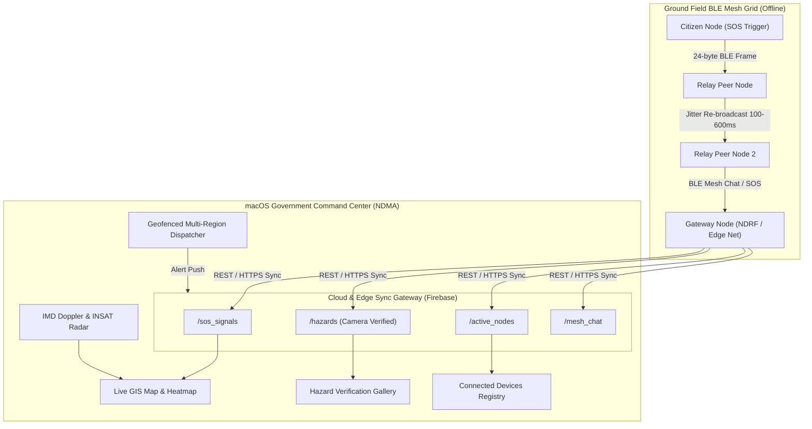

# 🦅 PROJECT GARUDA: Comprehensive Technical Report & PPT Guide
**Decentralized Offline-First Disaster Management & Multi-Hop BLE Mesh Ecosystem**
*Built for the Smart India Hackathon (SIH 2026) • Ministry of Home Affairs & NDMA Initiative*

---

## 📑 TABLE OF CONTENTS
1. [Executive Summary & Problem Statement](#1-executive-summary--problem-statement)
2. [Proposed Solution & Core Philosophy](#2-proposed-solution--core-philosophy)
3. [End-to-End System Architecture](#3-end-to-end-system-architecture)
4. [The 24-Byte Compact Binary Mesh Protocol](#4-the-24-byte-compact-binary-mesh-protocol)
5. [Citizen Mobile App Deep-Dive (Android)](#5-citizen-mobile-app-deep-dive-android)
6. [macOS Government Command Center Deep-Dive (NDMA)](#6-macos-government-command-center-deep-dive-ndma)
7. [Anti-Hoax & Zero-Trust Verification Framework](#7-anti-hoax--zero-trust-verification-framework)
8. [Competitive Advantage & Innovation Highlights](#8-competitive-advantage--innovation-highlights)
9. [Tech Stack & Engineering Standards](#9-tech-stack--engineering-standards)
10. [Slide-by-Slide PPT Presentation Blueprint (12 Slides)](#10-slide-by-slide-ppt-presentation-blueprint-12-slides)

---

## 1. Executive Summary & Problem Statement

### 🚨 The Real-World Crisis
During major natural calamities—such as the **2024 Wayanad Landslides**, **2023 Sikkim Flash Floods**, and recurring coastal cyclones (**Michaung, Biparjoy**)—the critical vulnerability is communication breakdown:
* **Tower Collapse & Blackouts:** Cellular base stations (BTS), fiber cables, and electrical grids are destroyed in the first 30 minutes.
* **The "Blackout Zone" Trap:** Survivors trapped under debris, floodwaters, or isolated valleys cannot call 112/108, share their GPS coordinates, or receive evacuation orders.
* **Hoax & False Panic Reports:** In chaotic situations, fake SOS messages and unverified rumors exhaust limited NDRF/SDRF rescue bandwidth.
* **Zero Command Telemetry:** Disaster authorities lack live ground maps of where survivors are clustered, which relief camps have spare bed capacity, or where active road blockages exist.

### 💡 Project Garuda Mission
**To guarantee zero-cellular, zero-internet survival communication by transforming every smartphone into an autonomous multi-hop mesh node, bridging trapped citizens directly to the National Disaster Management Authority (NDMA).**

---

## 2. Proposed Solution & Core Philosophy

Project Garuda is an **integrated, dual-tier disaster response ecosystem**:
1. **Tier 1 (Ground Field Grid):** Autonomous Android Citizen App operating over decentralized **Bluetooth Low Energy (BLE) Multi-Hop Mesh** (Zero cellular, Zero SIM, Zero internet required).
2. **Tier 2 (Apex Command Center):** Native macOS Command Center for NDMA / District Magistrates providing **Live GIS Heatmaps, Geofenced Multi-Region Emergency Dispatching, IMD Doppler Weather Radar, and Triage Queues**.
3. **Bridge (Store-and-Forward Gateway):** Any single citizen node or drone entering cellular/satellite range automatically uploads the ground mesh distress grid to the centralized Cloud database (**Firebase Firestore / FCM**).

```
[Trapped Survivor A] (No Internet)
       │  (BLE Hop #1 ~50m)
       ▼
[Citizen B in Shelter] (No Internet)
       │  (BLE Hop #2 ~50m)
       ▼
[NDRF Responder Node C] (Edge Cellular / Starlink)
       │  (HTTPS / Firestore Sync)
       ▼
[macOS Government Command Center (NDMA Headquarters)]
```

---

## 3. End-to-End System Architecture



---

## 4. The 24-Byte Compact Binary Mesh Protocol

Standard JSON payloads (~300-500 bytes) fail over legacy BLE advertising (31-byte limit). Project Garuda engineered an ultra-compact **24-byte binary protocol** that fits 100% inside legacy BLE advertising packets without fragmentation.

### 📦 Frame Specification
| Byte Offset | Field Name | Data Type | Purpose / Description |
| :--- | :--- | :--- | :--- |
| `0x00 - 0x01` | **Sync Header** | `0x4744` ("GD") | Proprietary protocol identifier |
| `0x02 - 0x03` | **Packet ID** | 16-bit Int | Unique packet ID for LRU deduplication |
| `0x04 - 0x07` | **Device Hash** | 32-bit Int | Unique UUID-backed device identifier |
| `0x08 - 0x0B` | **Timestamp** | 32-bit Unix Epoch | Generation time in seconds |
| `0x0C - 0x0F` | **Latitude** | 32-bit Fixed Point | Micro-degrees ($Lat \times 10^6$) |
| `0x10 - 0x13` | **Longitude** | 32-bit Fixed Point | Micro-degrees ($Lon \times 10^6$) |
| `0x14` | **Emergency Type** | 8-bit Enum | `0x01` Medical, `0x02` Trapped, `0x03` Heartbeat, `0x05` Hazard |
| `0x15` | **Hops & TTL** | 8-bit Bitmask | High 4-bits: Hop Count, Low 4-bits: TTL |
| `0x16 - 0x17` | **Checksum** | 16-bit CRC | End-to-end data integrity validation |

### ⚡ Key Routing Algorithms
* **LRU Deduplication Cache:** 500-entry sliding cache stops circular packet loops and duplicate processing.
* **Randomized Jitter Re-broadcast:** 100ms–600ms random delay before forwarding prevents RF packet collision.
* **Sliding Window Node Heartbeat (6s):** High-accuracy nearby peer tracking (`ACTIVE_PEER_TIMEOUT_MS = 6000L`).

---

## 5. Citizen Mobile App Deep-Dive (Android)

### 📲 4 Core Tab Architecture

#### 1. Emergency Core (`Tab 1`)
* **Standby Mode:** Displays real-time BLE Mesh Peer Badge (`🟢 Peers: 1`), 72-Hour Go-Bag Checklist, Offline Earthquake/Flood Guides, and Medical ID card.
* **Active SOS Mode:** 5-second countdown with visual/haptic abort safety, one-touch SOS dispatch, continuous BLE multi-hop beaconing, and automated background SMS distress dispatch.

#### 2. Mesh Walkie-Talkie & Chatroom (`Tab 2`)
* **Public Mesh (All):** Decentralized community channel for neighborhood alerts.
* **Private Direct (Family):** Point-to-point targeted encrypted messaging (`[PRIVATE:GD-XXXX]`) with persistent address book and 1-tap Copy ID.
* **Push-to-Talk (PTT) Voice Notes:** High-compression voice memo recording and mesh delivery for illiterate or trapped survivors.

#### 3. Live Relief Shelter Radar (`Tab 3`)
* **Distance Sorting & Bearing:** Live GPS distance (km) and compass direction to nearest relief camps.
* **District-Aware Geofencing:** Automatically filters and prioritizes shelters matching the user's current district (e.g. *Prayagraj / Wayanad*).
* **Capacity Indicators:** Real-time occupied vs available bed counts and medical team presence.

#### 4. Anti-Hoax Community Hazards (`Tab 4`)
* **Live Camera Geotagged Proof:** Direct camera launch (`TakePicturePreview()`) with real-time GPS coordinate stamping.
* **Verified Evidence Badge:** Prevents false reports by requiring photo proof for road blockages, bridge collapses, and electrical wire hazards.

---

## 6. macOS Government Command Center Deep-Dive (NDMA)

### 🖥️ Native SwiftUI Command Capabilities

1. **Multi-Region Geofenced Disaster Dispatcher:**
   - Command magistrates can declare Level 1/2/3 emergencies across single or multiple districts simultaneously using semicolon delimiters (e.g., `Prayagraj (Allahabad); Wayanad (Kerala)`).
   - Citizen phones in target districts receive instant audio sirens and evacuation directives; non-affected districts stay calm.
2. **Live GIS Map & Heatmap:**
   - Integrated MapKit GIS plotting real-time SOS distress clusters, active hazard markers, and safe evacuation corridors.
3. **Connected Devices & Mesh Network Registry:**
   - Real-time modal tracking all online nodes (`Cloud: Live` vs `Mesh: Relayed`), live battery levels, GPS coordinates, and hop distances.
4. **IMD Satellite & Doppler Weather Radar:**
   - Real-time Indian Meteorological Department (IMD) INSAT-3D/3DR satellite imagery and Doppler radar precipitation tracking.
5. **Survivor Triage & Rescue Management:**
   - Color-coded triage priority (Immediate Red, Delayed Yellow, Minimal Green) with 1-click status updates and offline CSV export.

---

## 7. Anti-Hoax & Zero-Trust Verification Framework

| Threat Vector | Project Garuda Solution |
| :--- | :--- |
| **Fake SOS Flooding** | Hardware-backed unique device hashes, rate limiting, and GPS micro-degree bounding. |
| **False Panic Hazards** | Mandatory camera photo proof with instant GPS timestamp watermark (`TakePicturePreview()`). |
| **RF Packet Collisions** | Randomized Jitter Backoff Algorithm (100ms - 600ms) & CRC16 checksums. |
| **Ghost / Dead Nodes** | 6-second sliding window heartbeat auto-purges inactive peers from the mesh grid. |
| **Tampered Alert Broadcasts** | Government disaster codes signed and geofenced to authorized district coordinates. |

---

## 8. Competitive Advantage & Innovation Highlights

| Feature | Conventional Systems (SMS/112) | FireChat / Bridgefy | **Project Garuda** |
| :--- | :--- | :--- | :--- |
| **Zero-Cellular Operation** | ❌ Fails on tower collapse | ⚠️ Basic text only | ✅ **Full SOS + Voice + Hazards + Shelters** |
| **Government Command HQ** | ❌ Disconnected | ❌ None | ✅ **Native macOS NDMA Command Center** |
| **Payload Optimization** | ❌ Heavy JSON (500B+) | ⚠️ Proprietary Bloat | ✅ **24-Byte Compact Binary Protocol** |
| **Anti-Hoax Verification** | ❌ Zero verification | ❌ Unmoderated | ✅ **Live Camera GPS Proof Required** |
| **Shelter Telemetry** | ❌ Static website | ❌ None | ✅ **Live Bed Capacity & Distance Radar** |
| **Voice Walkie-Talkie** | ❌ Cellular dependent | ❌ Text only | ✅ **Offline PTT Voice Notes over Mesh** |

---

## 9. Tech Stack & Engineering Standards

* **Android Mobile (`:app`, `:core:mesh`, `:core:data`):** Kotlin 1.9+, Jetpack Compose, Material 3, Android BLE Advertiser & Scanner APIs, CameraX, Room DB, Kotlin Coroutines & SharedFlow.
* **macOS Command Center (`garuda-macos`):** Swift 5.9, Native SwiftUI, MapKit, WebKit, Combine, Apple Network Framework.
* **Cloud & Edge Synchronization:** Firebase Firestore REST API, Firebase Cloud Messaging (FCM), Geohash Indexing.
* **Binary Serialization:** Custom Bitwise Endian-Safe Protocol Encoder/Decoder with CRC16 verification.

---

## 10. Slide-by-Slide PPT Presentation Blueprint (12 Slides)

Use this exact structure for your PowerPoint presentation:

### 🎬 Slide 1: Title & Hero
* **Title:** PROJECT GARUDA 🦅
* **Subtitle:** Decentralized Offline-First Disaster Management & Multi-Hop BLE Mesh Grid
* **Event:** Smart India Hackathon (SIH 2026)
* **Team:** Team Garuda

### 🌪️ Slide 2: The Problem (The Blackout Trap)
* **Key Point:** Cellular towers and power grids collapse in the first 30 minutes of natural disasters.
* **Stats:** Wayanad (2024), Sikkim (2023), Cyclone Biparjoy—hundreds stranded without 112/108 access.
* **Pain Points:** 1) Zero communication 2) Unverified rumors/hoaxes 3) Lack of real-time NDRF ground maps.

### 💡 Slide 3: The Solution (Project Garuda Overview)
* **Core Concept:** Turn every citizen smartphone into an autonomous multi-hop relay node.
* **Dual Ecosystem:**
  1. Offline Android Citizen App (Zero cellular, zero internet).
  2. macOS Government Command Center for NDMA / District Magistrates.
* **Tagline:** *"Zero Network. Zero Infrastructure. 100% Resilient."*

### 🛰️ Slide 4: System Architecture & Dual-Channel Mesh
* *[Embed Mermaid Diagram from Section 3]*
* Multi-hop BLE forwarding across citizens $\rightarrow$ Edge gateway node $\rightarrow$ Central Cloud $\rightarrow$ NDMA Command Center.

### 📦 Slide 5: The 24-Byte Compact Binary Protocol
* **Why not JSON?** JSON is 500+ bytes; BLE advertisement limit is 31 bytes.
* **Our Innovation:** 24-byte binary frame carrying Sync Header, Packet ID, Device Hash, Fixed-point Lat/Lon, SOS Type, Hops, TTL, and CRC16.
* **Smart Routing:** LRU Deduplication (500 entries) + Randomized Jitter (100–600ms) to eliminate RF collisions.

### 📱 Slide 6: Citizen App — SOS & Mesh Walkie-Talkie
* **Standby & Active SOS:** Real-time peer counter (`🟢 Peers: 1`), 5s safety abort, auto-SMS distress.
* **Mesh Chat:** Public neighborhood channel + Private 1-to-1 family chat + Push-to-Talk (PTT) Voice Memos.

### 🛡️ Slide 7: Citizen App — Anti-Hoax Hazards & Shelter Radar
* **Camera-Verified Hazards:** Geotagged live photos prevent hoax panic.
* **Relief Shelter Radar:** Live GPS distance sorting, compass bearing, and bed capacity indicators.

### 🖥️ Slide 8: Government Command Center (NDMA Headquarters)
* **Multi-Region Geofencing:** Declare emergency alerts targeting specific districts with instant sirens.
* **Connected Devices Registry:** Live ground grid tracking battery %, GPS, and hop count.
* **IMD Weather Radar:** Real-time INSAT-3D/3DR satellite & Doppler radar integration.

### 🏥 Slide 9: Live GIS Heatmap & Survivor Triage
* Real-time triage queue: Immediate (Red), Delayed (Yellow), Minimal (Green).
* 1-click status dispatch and offline CSV reporting for field rescue teams.

### ⚡ Slide 10: Anti-Hoax & Zero-Trust Security
* Mandatory live camera proof with GPS timestamp watermark.
* Hardware UUID device hashes with 6s sliding window peer heartbeat.

### 📊 Slide 11: Competitive Advantage & Impact Matrix
* *[Embed Comparison Table from Section 8]*
* Comparison against conventional 112, SMS, FireChat, and Bridgefy.

### 🚀 Slide 12: Future Roadmap & Conclusion
* **Roadmap:** LoRa / Drone-mounted BLE Relay gateways for high-altitude Himalayas; Integration with National Disaster Response Force (NDRF) CAD systems.
* **Closing Statement:** *"Project Garuda ensures that when all infrastructure falls, the human network stands strong."*
* **Q&A:** Thank You!

---
*Report generated and certified for Project Garuda (SIH 2026).*
